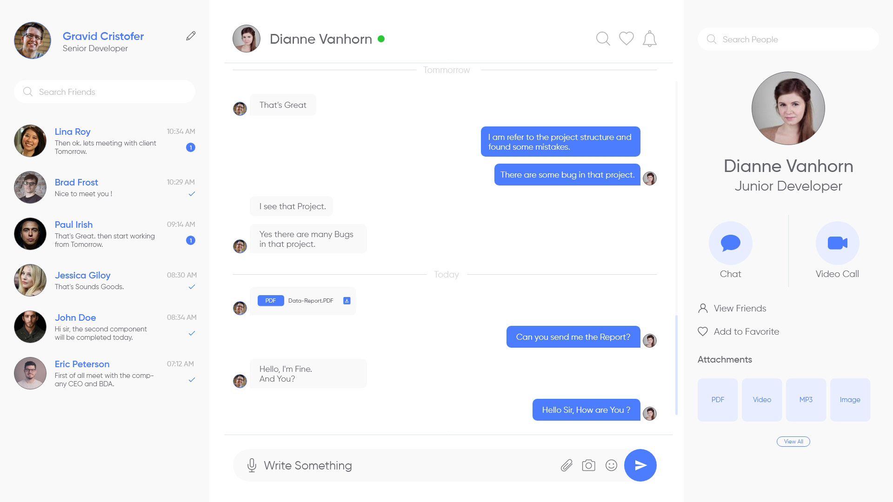
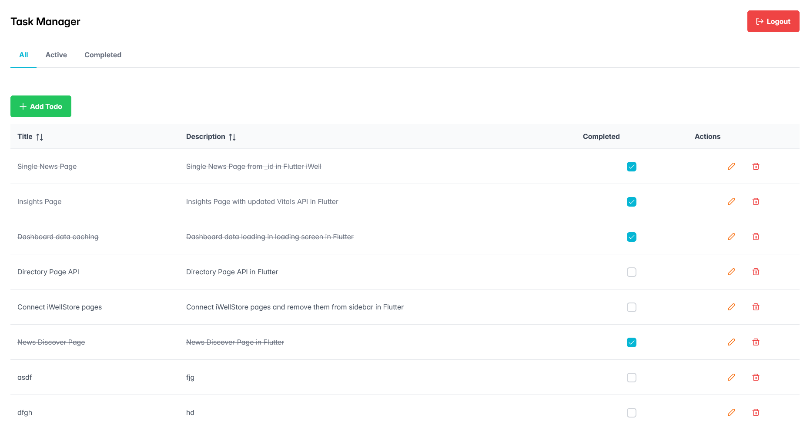

# 🎯 JavaScript Exercises curated by [BhavyaJustChill](https://github.com/bhavyajustchill)

## 🟢 JavaScript Exercises (Tier 1 - Beginner)

### 1. 🌀 Fibonacci Sequence Generator

Write an arrow function that generates the first `n` numbers in the Fibonacci sequence.

### 2. 🔢 Array Filtering

Create an arrow function that takes an array of numbers and returns a new array containing only the even numbers.

### 3. ✨ String Capitalizer

Implement an arrow function that capitalizes the first letter of each word in a given string.

### 4. 🔄 Variable Scope Demonstration

Demonstrate the difference between `var`, `let`, and `const` by writing a function that declares variables using each keyword within different scopes (e.g., inside a loop or conditional).

### 5. 🛡️ Immutable Object Creation

Use `const` to create an object and attempt to modify its properties. Explain the behavior.

### 6. 👋 Personalized Greeting

Write a function that takes a user's name and age and returns a personalized greeting message using template literals.

### 7. 🖼️ HTML Snippet Generator

Create a function that generates a simple HTML card component as a string using template literals. The card should include a title, image URL, and description.

### 8. 📦 Object Destructuring

Given an object representing a book with properties like `title`, `author`, `year`, and `genre`, use destructuring to extract these properties into separate variables.

### 9. 📑 Array Destructuring

Write a function that takes an array of user information `[firstName, lastName, email]` and uses destructuring to assign each element to a corresponding variable.

### 10. ➕ Merging Arrays

Use the spread operator to merge two arrays into one.

### 11. 📚 Function Argument Collector

Create a function that accepts any number of numerical arguments and returns their sum using the rest operator.

### 12. 🏗️ Class Creation

Define a `Person` class with properties `name` and `age`, and a method `greet()` that returns a greeting message.

### 13. 🌱 Inheritance Implementation

Create a `Student` class that inherits from the `Person` class and adds an additional property `grade`. Override the `greet()` method to include the student's grade in the message.

### 14. 📤 Module Export and Import

Create two JavaScript files where one file exports a function and the other imports and uses that function.

### 15. 🏷️ Named vs. Default Exports

Demonstrate the difference between named and default exports by creating examples of each and showing how to import them.

### 16. ⏳ Basic Promise

Write a function that returns a promise which resolves after 2 seconds with a message `"Promise Resolved!"`.

### 17. 🌐 Fetching Data with Promises

Create a function that fetches data from a public API (e.g., JSONPlaceholder) using `fetch` and handles the response with `.then()` and `.catch()`.

### 18. 🚀 Async/Await Implementation

Rewrite the previous exercise using `async/await` syntax instead of `.then()` and `.catch()`.

### 19. 🔄 Custom Iterator

Implement a custom iterator for an object that allows iterating over its properties using a `for...of` loop.

### 20. 🔬 Generator Function

Write a generator function that yields the first `n` prime numbers.

### 21. 🔍 Find and Filter

Given an array of user objects, write a function to find a user by their ID and another function to filter users based on a specific criteria (e.g., age greater than 30).

### 22. 💰 Reduce to Compute Totals

Use the `reduce` method to calculate the total price of items in a shopping cart array.

### 23. 🛠️ Try/Catch Implementation

Write a function that attempts to parse a JSON string and uses `try/catch` to handle any potential errors gracefully.

### 24. 📡 API Data Retrieval

Use any library (like `axios`) or the built-in `fetch()` to call an API and retrieve data.

---

## ⚛️ React.js Exercises (Tier 2 - Intermediate)

### 1. 🔄 Dynamic, Reusable Component

Create any dynamic, reusable component.  
_Example:_ [React Bhavya Table](https://github.com/bhavyajustchill/react-bhavya-table)

### 2. 🧮 Calculator App

Build a simple calculator application with basic arithmetic operations.

### 3. 📝 To-Do List

Develop a to-do list application where users can add, delete, and mark tasks as completed.

### 4. 🔄 Palindrome Checker

Create a React app that checks if a given string is a palindrome.

### 5. 💬 Random Quote Generator

Build an application that displays a random quote each time a button is clicked.

### 6. ☀️ Weather App

Develop a weather application that fetches and displays weather data based on user input or geolocation.

### 7. 🎮 Simple Tic-Tac-Toe Game

Create a Tic-Tac-Toe game with a user interface that allows two players to play against each other.

### 8. 🛒 Shopping Cart

Build a shopping cart component where users can add items, adjust quantities, and view the total price.

---

## 🛠️ MERN Stack Exercises (Tier 3 - Advanced)

**📝 Note:** To set up the backend, use one of the following commands to get the starter backend project:

- `npx create-bhavya-js-api@latest <project_name>` (JavaScript with MVC architecture)
- `npx create-bhavya-ts-api@latest <project_name>` (TypeScript with Modular Architecture)

### 1. 💬 Real Time Chat

Develop a real-time chat application using the MERN stack (MongoDB, Express.js, React.js, Node.js).  
Features should include user authentication, real-time messaging, and chat rooms.

### 2. 🗂️ A CRUD App

Develop a CRUD (Create, Retrieve/Read, Update, Delete) App using the MERN stack (MongoDB, Express.js, React.js, Node.js).

---

### 📌 **Note**

- ✅ Ensure to follow best practices for each exercise.
- 📝 Comment your code where necessary to explain your logic.
- 🧪 Test your functions/components thoroughly to handle edge cases.

**Happy Coding!** 🚀
